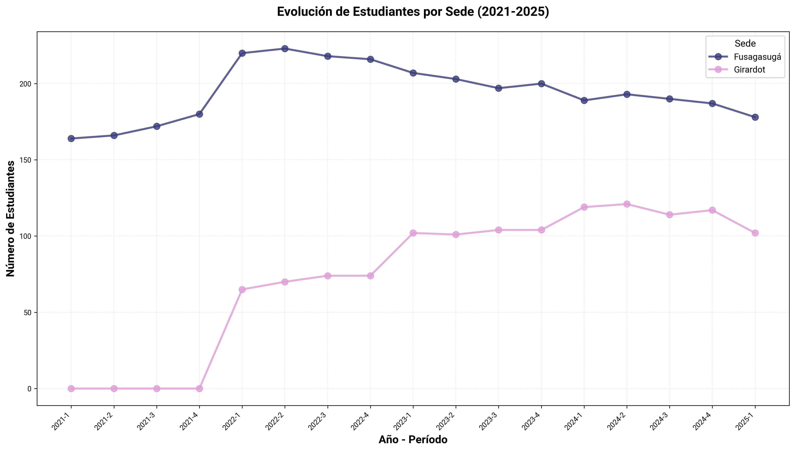
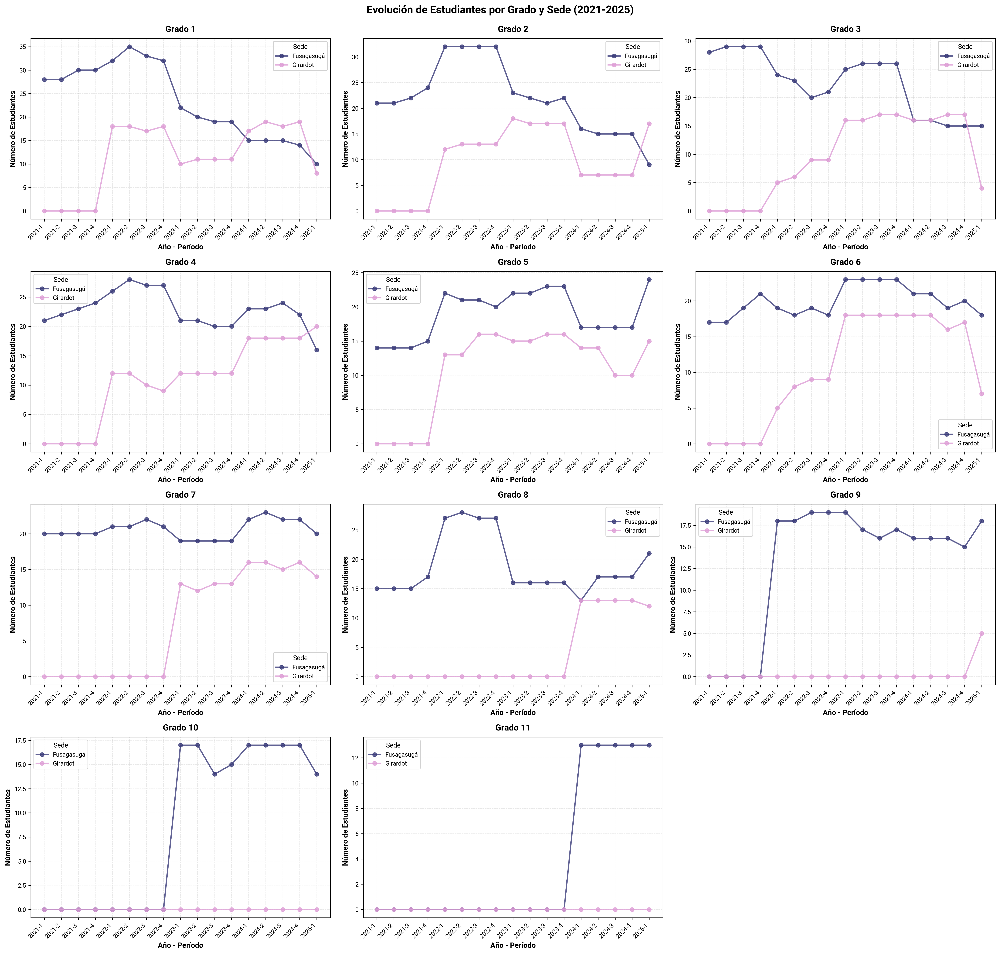
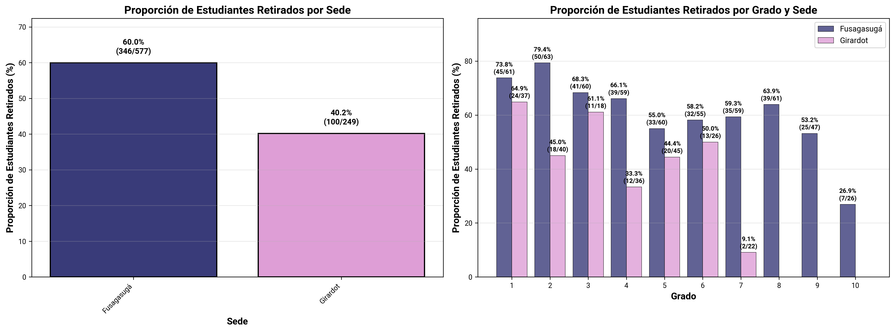
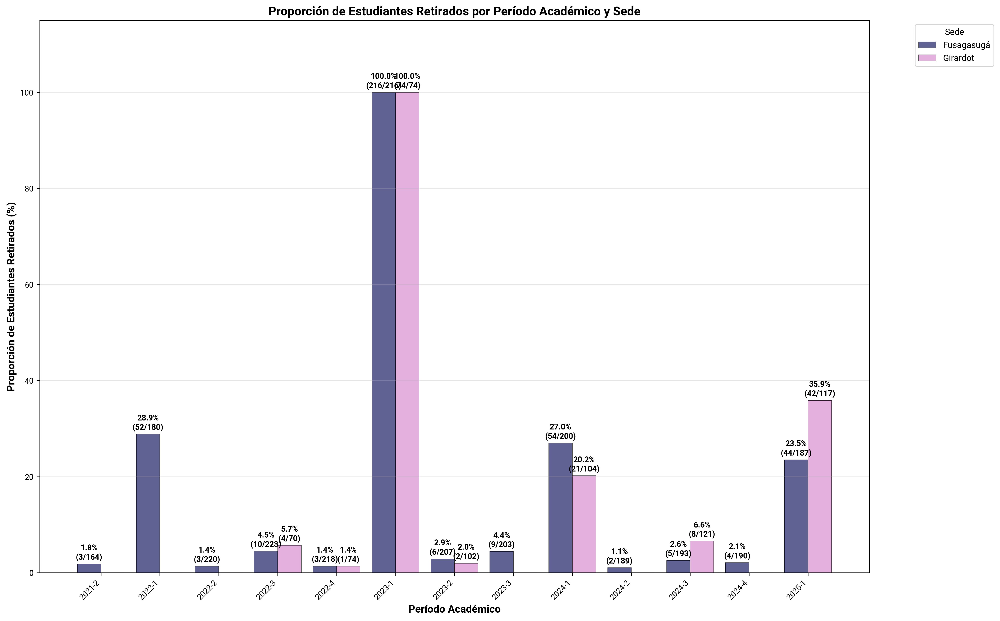
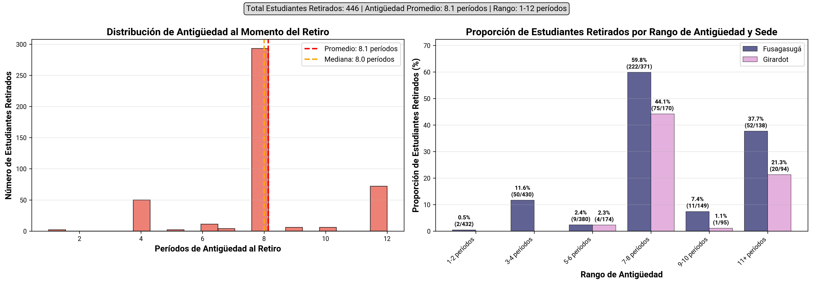
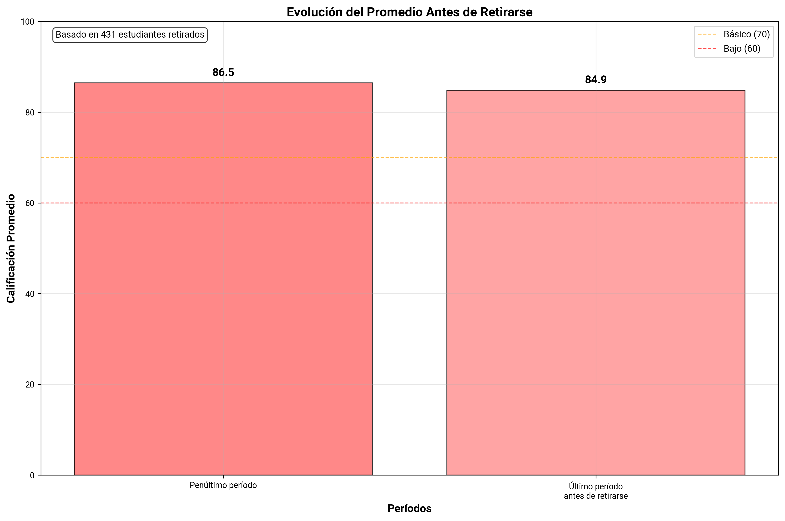
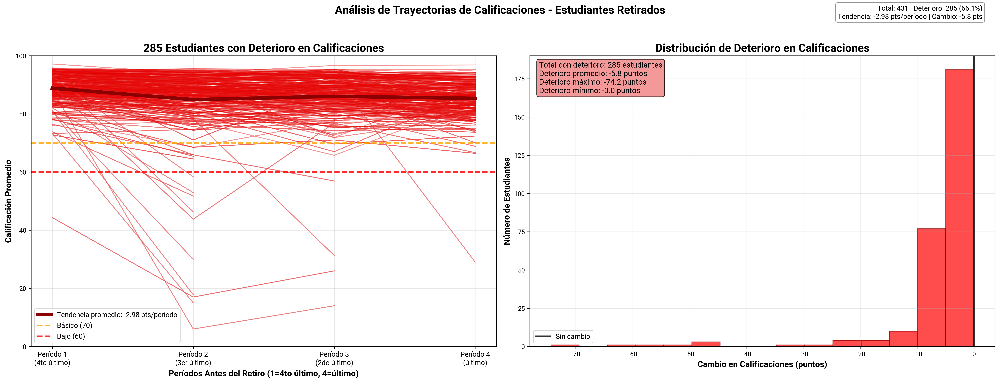
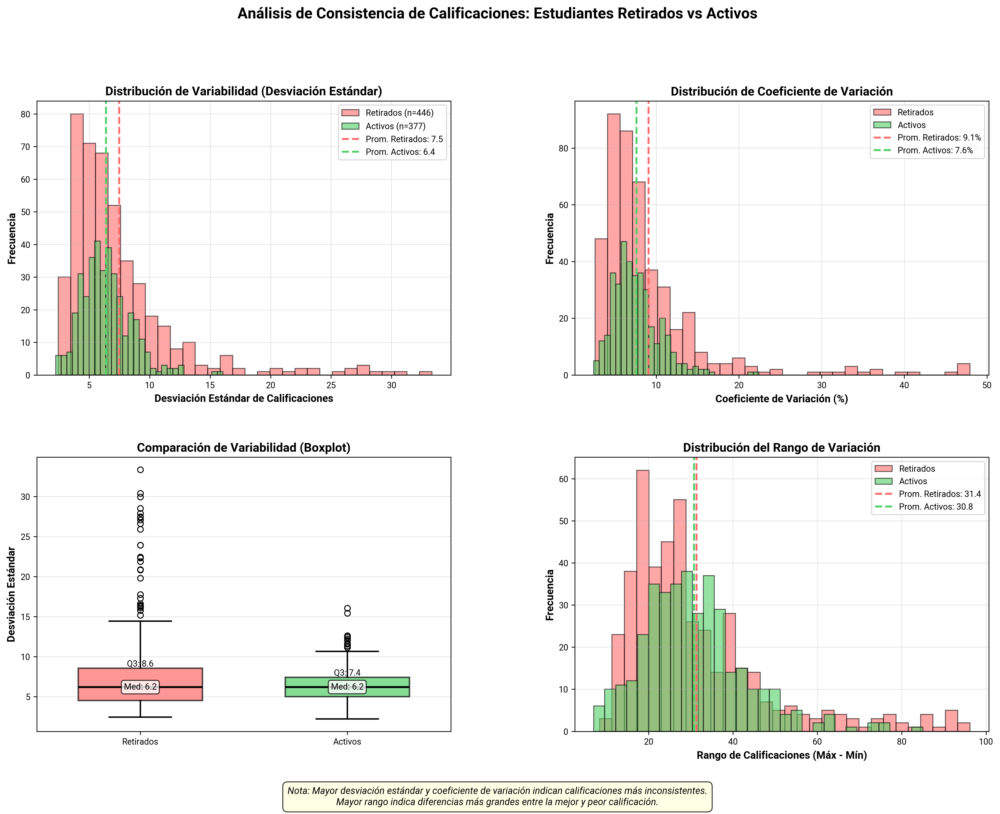
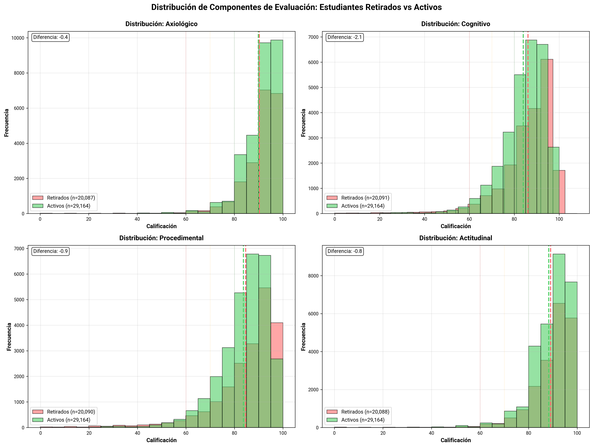

# Análisis de Retiro de Estudiantes 2021-2025

## Resumen

Este análisis explora los patrones de retiro escolar de estudiantes.

**Período analizado:** 2021-1 a 2025-1  
**Sedes:** Fusagasugá, Girardot  
**Grados:** 1 - 11  
**Total estudiantes únicos:** 603  
**Estudiantes retirados:** 223 (37.0%)  
**Estudiantes activos:** 380 (63.0%)

---

## 1. Evolución Temporal de Matrícula por Sede

Gráfico de líneas que muestra la evolución de la matrícula total a lo largo de los períodos académicos, comparando ambas sedes.

### Interpretación

- **Ejes:**
  - **Horizontal:** Períodos académicos (año-semestre)
  - **Vertical:** Número total de estudiantes matriculados

- **Análisis temporal:**
  - **Tendencia creciente:** Expansión de cobertura
  - **Tendencia decreciente:** Pérdida de estudiantes
  - **Estabilidad:** Equilibrio entre nuevos ingresos y retiros
  - **Fluctuaciones estacionales:** Patrones recurrentes por semestre

### Conclusiones

- En Fusagasugá a partir de 2022 se observa un declive progresivo y constante. Este comportamiento sugiere una reducción en la retención o en el ingreso de nuevos estudiantes.

- La sede Girardot muestra una expansión rápida, luego mantiene estabilidad, con pequeñas variaciones, aunque se nota una leve caída en el último período 2025-1.

## 2. Evolución Temporal de Matrícula por Grado y Sede

Gráficos por cada grado académico mostrando la evolución temporal del número de estudiantes matriculados a lo largo de los períodos académicos, con líneas diferenciadas por sede.

### Interpretación

- **Cada gráfico contiene:**
  - **Eje horizontal:** Períodos académicos (año-semestre)
  - **Eje vertical:** Número de estudiantes matriculados

- **Patrones a identificar por grado:**
  - **Tendencias temporales:** Crecimiento, decrecimiento o estabilidad de matrícula
  - **Diferencias entre sedes:** Comparar trayectorias de Fusagasugá y Girardot
  - **Fluctuaciones:** Variaciones período a período
  - **Períodos críticos:** Caídas abruptas en matrícula

### Conclusiones

- En la mayoría de los grados se observa una disminución progresiva en la matrícula.

- Los grados 8.º a 11.º presentan la mayor pérdida de estudiantes.

## 3. Proporción de Estudiantes Retirados por Grado y Sede

Gráficos de barras que muestran las proporciones de retiro escolar desagregadas por sede (panel izquierdo) y por grado académico (panel derecho).

### Interpretación

- **Panel izquierdo - Proporción por Sede:**
  - **Eje horizontal:** Sedes (Fusagasugá, Girardot)
  - **Eje vertical:** Proporción de estudiantes retirados (%)

- **Panel derecho - Proporción por Grado y Sede:**
  - **Barras agrupadas:** Proporción de estudiantes retirados para cada grado, separadas por sede
  - **Eje horizontal:** Grados académicos (1 a 10)
  - **Eje vertical:** Proporción de estudiantes retirados (%)

### Conclusiones

- Fusagasugá tiene mayor incidencia de retiro (43.7%) frente a Girardot (22.8%).

- En Fusagasugá, los grados 2°, 3°, 6° y 8° destacan con tasas superiores al 40%, alcanzando un máximo del 67.5% en grado 2°.

- En Girardot, aunque el retiro está presente en todos los grados, las tasas son más bajas y estables, sin picos críticos marcados.

## 4. Proporción de Estudiantes Retirados por Período Académico y Sede

Gráfico de barras agrupadas que muestra la proporción de estudiantes retirados (%) por período académico, con barras diferenciadas por sede.

### Interpretación

- **Eje horizontal:** Períodos académicos (año-semestre)
- **Eje vertical:** Proporción de estudiantes retirados (porcentaje)
- **Barras:** Una barra por sede en cada período, mostrando el porcentaje de estudiantes que se retiraron

- **Metodología:** 
  - Para cada período N, se calcula: (Estudiantes que estaban en N-1 pero no en N) / (Total estudiantes en N-1) × 100
  - Excluye solo el primer período (sin período anterior para comparar)
  - La proporción se asigna al período N donde se detecta el retiro de estudiantes

- **Patrones a identificar:**
  - **Picos de retiro:** Períodos específicos con proporciones elevadas
  - **Tendencias temporales:** Mejora o deterioro progresivo
  - **Períodos críticos:** Momentos del año con mayor vulnerabilidad

### Conclusiones

- Los mayores picos de retiro se observan sistemáticamente en los períodos 2022-1, 2023-1, 2024-1 y 2025-1, la mayoría de los retiros ocurren entre el cierre de un año académico y el inicio del siguiente.

- Fusagasugá muestra una reducción sostenida después de 2023-1, indicando mejor retención reciente.

- Los niveles de retiro son más inestables, con un aumento abrupto en 2025-1, el valor más alto de toda la serie.

## 5. Análisis de Antigüedad al Momento del Retiro

Análisis combinado que muestra la distribución de períodos de permanencia de los estudiantes antes de retirarse, junto con las proporciones de retiro por rangos de antigüedad.

### Metodología

**Cálculo de antigüedad:** Se calcula el número de períodos académicos que cada estudiante estuvo activo antes de retirarse, basado en su último período registrado en el sistema.

**Rangos de análisis:** Los estudiantes se agrupan en rangos de antigüedad (1-2, 3-4, 5-6, 7-8, 9-10, 11+ períodos) para analizar patrones de retiro por experiencia académica.

### Interpretación

- **Panel izquierdo - Distribución de Antigüedad:**
  - **Histograma rojo:** Muestra cuántos estudiantes se retiran en cada rango de períodos
  - **Línea roja discontinua:** Antigüedad promedio al retiro
  - **Línea naranja discontinua:** Antigüedad mediana al retiro
  - **Eje horizontal:** Número de períodos de permanencia
  - **Eje vertical:** Número de estudiantes retirados

- **Panel derecho - Proporción de Estudiantes Retirados por Antigüedad y Sede:**
  - **Barras agrupadas:** Proporción de estudiantes retirados para cada rango de antigüedad
  - **Valores en barras:** Porcentaje de retiro y fracción (retirados/total en rango)
  - **Eje horizontal:** Rangos de antigüedad (1-2, 3-4, etc.)
  - **Eje vertical:** Proporción de estudiantes retirados (%)

### Conclusiones

- La antigüedad promedio al retiro es de 8.4 períodos, equivalente a 2 años académicos.

- Los retiros se concentran en los rangos de 7–8 y 11+ períodos, lo que evidencia que muchos abandonos ocurren en etapas avanzadas del proceso formativo.

- Fusagasugá concentra la mayor proporción de retiros en los rangos más altos, lo que sugiere dificultades de retención en niveles superiores.

## 6. Desempeño Académico antes del Retiro

Gráfico de barras que muestra el promedio de calificaciones de estudiantes retirados en sus últimos períodos académicos antes del retiro.

### Interpretación

- **Eje horizontal:** Categorías de períodos "Último período antes de retirarse" y "Penúltimo período"
- **Eje vertical:** Calificación promedio (0-100)
- **Barras:** Cada barra representa el promedio agregado de todos los estudiantes retirados en ese momento temporal

- **Líneas de referencia:**
  - 🔴 **60:** Umbral de aprobación (Bajo)
  - 🟠 **70:** Inicio de desempeño Básico

- **Valores en barras:** Promedio de calificaciones

- **Nota:** El gráfico se basa en promedios agregados de la cohorte de retirados, no en trayectorias individuales

### Conclusiones
- El promedio en el último período antes del retiro fue 83.6 puntos, en el rango alto, lo que indica que el retiro no está necesariamente vinculado con bajo rendimiento.

## 7. Deterioro Académico Individual (122 Estudiantes)

Este gráfico de dos paneles esta enfocado en **122 estudiantes retirados** que mostraron deterioro en sus calificaciones antes del retiro, representando el 57.8% del total de estudiantes retirados.

### Interpretación

- **Panel izquierdo - Trayectorias de Deterioro:**
  - **122 líneas rojas:** Trayectorias individuales de cada estudiante con deterioro
  - **Línea roja gruesa:** Tendencia promedio de deterioro (-3.77 pts/período)
  - **Períodos:** Últimos 4 períodos antes del retiro
  - **Líneas de referencia:** 60 (bajo) y 70 (básico) puntos

- **Panel derecho - Distribución del Deterioro:**
  - **Histograma rojo:** Distribución de la magnitud del deterioro en puntos
  - **Estadísticas:** Deterioro promedio, máximo y mínimo
  - **Línea negra:** Punto de referencia (sin cambio)

### Conclusiones

- El 57.8% de los retirados (122 estudiantes) muestran un deterioro académico sostenido antes de retirarse.

- La mayoría de los estudiantes presentan caídas moderadas pero consistentes, reforzando la idea de un proceso de desvinculación gradual, más que un evento abrupto.

- Este patrón sugiere una ventana de intervención de al menos dos períodos antes del retiro definitivo.

## 8. Análisis de Consistencia de Calificaciones

Gráficas que analiza múltiples métricas de variabilidad en el rendimiento académico, comparando estudiantes retirados (rojo) con estudiantes activos (verde).

### Interpretación

- **Gráfico 1 (superior izquierdo) - Distribución de Desviación Estándar:**
  - Histogramas superpuestos mostrando la dispersión de variabilidad
  - Líneas discontinuas verticales indican el promedio de cada grupo
  
- **Gráfico 2 (superior derecho) - Coeficiente de Variación:**
  - Histogramas de variabilidad relativa (%) - normalizada por el promedio
  - Filtrado a CV < 50% para mejor visualización
  
- **Gráfico 3 (inferior izquierdo) - Boxplots Comparativos:**
  - Boxplots de desviación estándar para comparación directa entre grupos
  
- **Gráfico 4 (inferior derecho) - Distribución del Rango:**
  - Histogramas del rango de calificaciones (Máx - Mín)
  - Indica amplitud total de variación por estudiante

- **Interpretación de resultados:**
  - **Mayor desviación estándar/rango:** Calificaciones más erráticas, posible señal de alerta
  - **Menor desviación estándar/rango:** Calificaciones estables, trayectoria más predecible

### Conclusiones

- Los estudiantes retirados presentan una mayor dispersión en sus calificaciones, con una desviación estándar promedio de 8.3 frente a 6.5 en los activos, y un coeficiente de variación promedio de 10.1% vs 7.7% respectivamente. Esto sugiere trayectorias académicas más inestables y fluctuaciones marcadas en su desempeño.

- El grupo de retirados muestra una mayor variabilidad interna y más valores atípicos, lo que refleja que varios estudiantes experimentaron altas oscilaciones entre asignaturas o períodos.

## 9. Comparación de Competencias: Retirados vs Activos

Gráficos con histogramas superpuestos que comparan el desempeño en cada competencia evaluada entre estudiantes retirados (rojo) y activos (verde).

### Interpretación

- **Formato:** Cuatro gráficos independientes, uno por cada competencia
- **Cada gráfico contiene:**
  - Histogramas superpuestos (retirados en rojo, activos en verde)
  - Líneas discontinuas verticales con promedios de cada grupo

- **Análisis comparativo:**
  - Comparar distribuciones completas, no solo promedios
  - Identificar competencias con mayores diferencias entre grupos
  - Detectar si alguna competencia es mejor predictor de retiro

### Conclusiones

- Las distribuciones de ambos grupos son similares, concentradas en rangos altos (80–100).

- No existen diferencias significativas entre retirados y activos.

- Las diferencias promedio son mínimas en todas las competencias (entre -0.3 y +0.8 puntos), lo que sugiere que los estudiantes retirados no presentaban un bajo rendimiento evidente previo al retiro.

- La competencia cognitiva es la única con diferencia negativa (-0.3), indicando un leve menor desempeño entre los retirados.

- Esto sugiere que el rendimiento por competencias no predice directamente el retiro. 