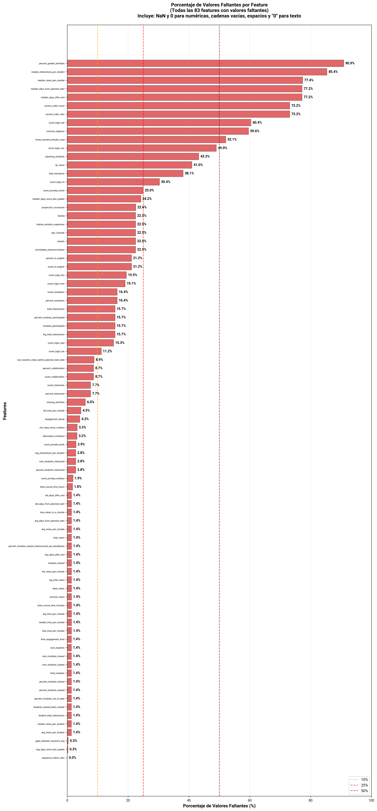
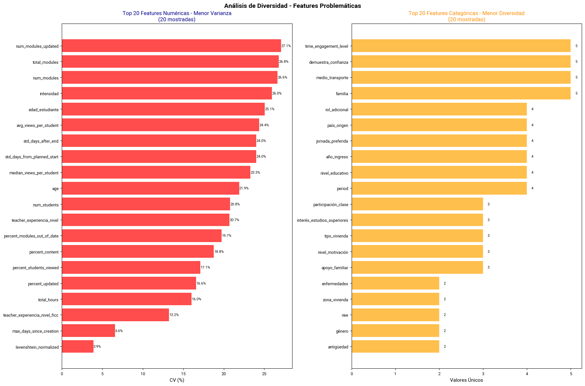

# Análisis de Valores Faltantes

Análisis de valores faltantes del dataset de Moodle (Ciencias Sociales, Ciencias Naturales, Matemáticas y Lengua Castellana)

## Porcentaje de Valores Faltantes
**Gráfica de barras horizontales** que muestra el porcentaje de valores faltantes por cada feature del dataset.

**Qué muestra:**
- Cada barra representa una feature (variable) del dataset
- La longitud de la barra indica el porcentaje de valores faltantes
- Las features están ordenadas de menor a mayor porcentaje de valores faltantes
- Los valores exactos se muestran al final de cada barra

**Criterios de valores faltantes:**
- **Variables numéricas:** NaN y valores igual a 0
- **Variables de texto:** NaN, cadenas vacías, espacios en blanco, 'nan', 'none', 'null' y '0'

## Análisis de Diversidad de Features
**Gráfica de doble panel** que analiza la diversidad de valores en las features del dataset.

**Panel izquierdo - Features Numéricas:**
- Muestra las 20 features numéricas con menor varianza (coeficiente de variación más bajo)
- El coeficiente de variación (CV) indica qué tan dispersos están los valores
- Features con CV muy bajo pueden indicar poca variabilidad en los datos

**Panel derecho - Features Categóricas:**
- Muestra las 20 features categóricas con menor diversidad (menor número de valores únicos)
- Features con muy pocos valores únicos pueden ser poco informativas
- Ayuda a identificar variables que podrían necesitar transformación o eliminación
