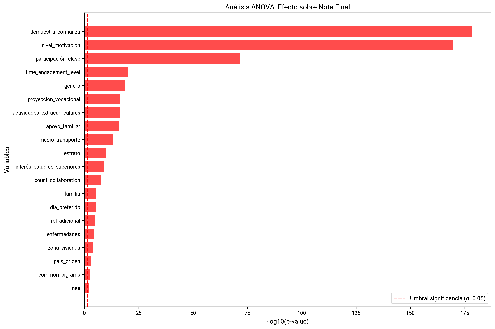
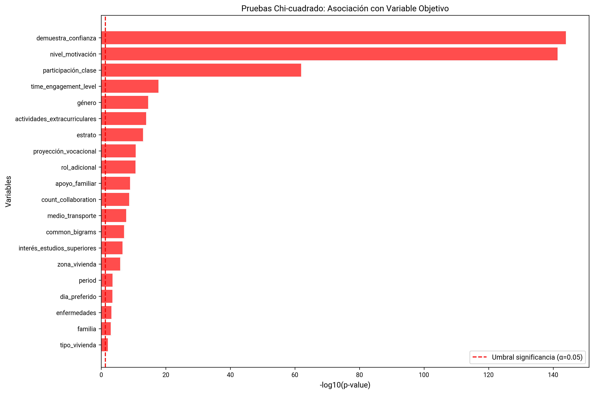

# Análisis de Filtrado Estadístico

Análisis estadístico de correlaciones, ANOVA y Chi-cuadrado para el dataset de Moodle (Ciencias Sociales, Ciencias Naturales, Matemáticas y Lengua Castellana)

## Análisis de Correlación
Gráficas de barras horizontales que muestran las correlaciones de Pearson y Spearman con la variable objetivo.

**Qué muestra:**
- Dos gráficos lado a lado: correlación de Pearson (izquierda) y Spearman (derecha)
- Las barras rojas indican correlaciones significativas (p < 0.05)
- Las variables están ordenadas por p-value de Pearson (más significativas arriba)
- Muestra las 20 variables con mayor significancia estadística
- Línea vertical en cero para distinguir correlaciones positivas y negativas
- Ayuda a identificar variables con correlación significativa con la nota final

## Análisis ANOVA
Gráfica de barras que muestra los resultados del análisis de varianza (ANOVA) para variables categóricas.

**Qué muestra:**
- Gráfico de barras horizontales con -log10(p-value) en el eje X
- Las barras rojas indican variables significativas (p < 0.05)
- Variables ordenadas por p-value (más significativas arriba)
- Muestra las 20 variables con mayor significancia estadística
- Línea vertical roja indica el umbral de significancia (α=0.05)
- Identifica qué variables categóricas tienen diferencias significativas entre grupos

## Análisis Chi-cuadrado
Gráfica de barras que muestra los resultados de las pruebas de independencia Chi-cuadrado.

**Qué muestra:**
- Gráfico de barras horizontales con -log10(p-value) en el eje X
- Las barras rojas indican variables significativas (p < 0.05)
- Variables ordenadas por p-value (más significativas arriba)
- Muestra las 20 variables con mayor significancia estadística
- Línea vertical roja indica el umbral de significancia (α=0.05)
- Identifica asociaciones significativas entre variables categóricas
