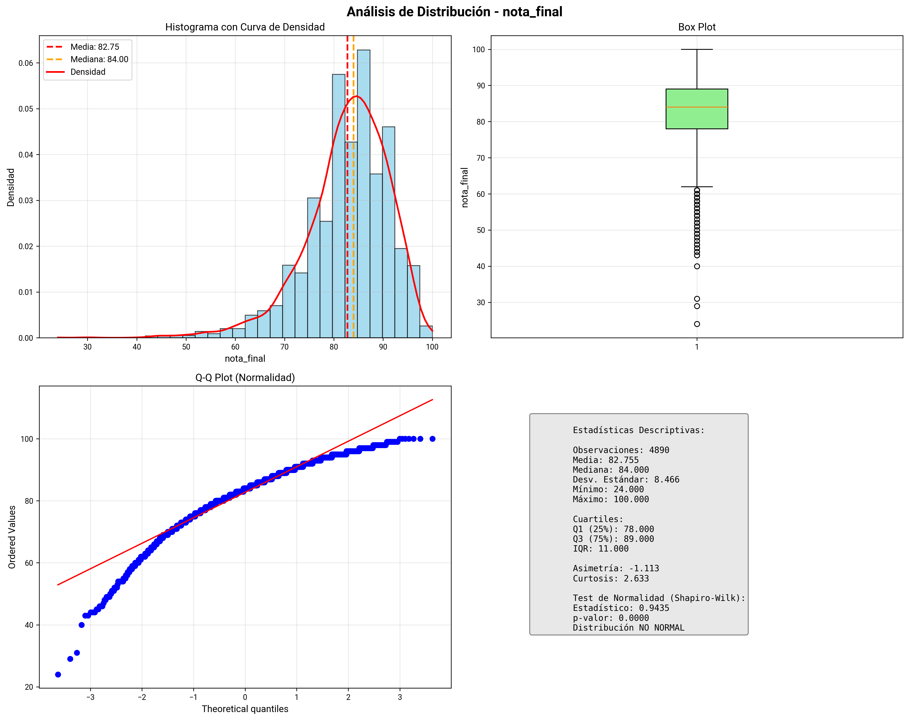
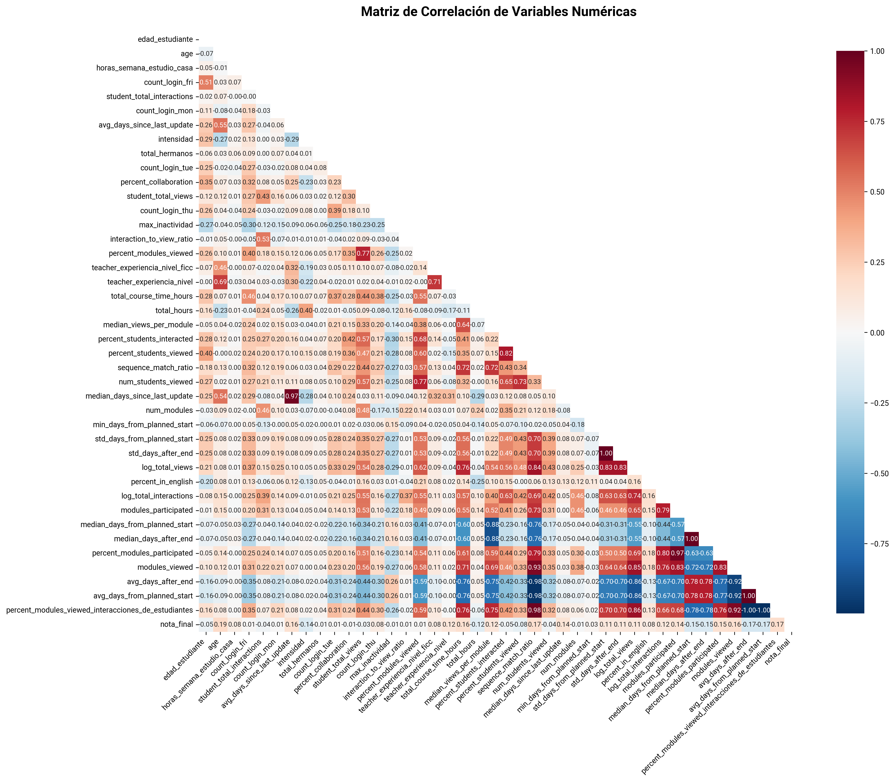
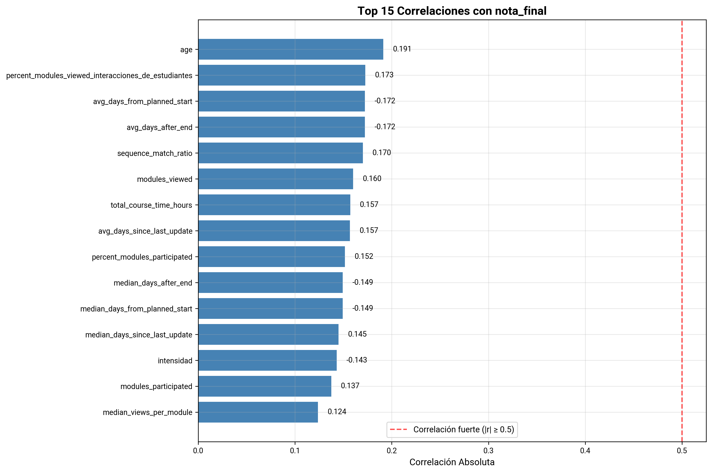

# Análisis de Visualización de Datos

Análisis exploratorio de datos (EDA) con visualizaciones para el dataset de Moodle (Ciencias Sociales, Ciencias Naturales, Matemáticas y Lengua Castellana)

## Análisis de Distribución de Variable Objetivo: Nota Final

Análisis completo de la distribución de la variable respuesta numérica con múltiples visualizaciones.

**Qué muestra:**
- **Histograma con curva de densidad**: Distribución de frecuencias con curva de densidad superpuesta
- **Box plot**: Visualización de cuartiles, mediana y valores atípicos
- **Q-Q plot**: Verificación de normalidad de la distribución
- **Estadísticas descriptivas**: Media, mediana, desviación estándar, asimetría, curtosis y test de normalidad (Shapiro-Wilk)
- Líneas de referencia para media (roja) y mediana (naranja)
- Ayuda a identificar la forma de la distribución y detectar desviaciones de la normalidad

## Matriz de Correlación

Visualización de correlaciones entre todas las variables numéricas del dataset.

**Qué muestra:**
- Heatmap triangular con valores de correlación de Pearson
- Escala de colores: rojo (correlación positiva fuerte), azul (correlación negativa fuerte)
- Valores de correlación anotados en cada celda
- Identifica patrones de correlación entre variables numéricas

### Correlaciones con Variable Objetivo

**Qué muestra:**
- Top 15 variables con mayor correlación absoluta con la variable objetivo
- Barras rojas: correlaciones fuertes (|r| ≥ 0.5)
- Barras azules: correlaciones moderadas o débiles
- Línea de referencia en 0.5 para correlaciones fuertes

## Scatter Plots vs Variable Objetivo

Análisis de la relación entre cada variable numérica y la variable objetivo.

**Qué muestra:**
- Scatter plot individual para cada variable numérica vs variable objetivo
- Línea de tendencia (regresión lineal) en rojo
- Coeficiente de correlación de Pearson y p-valor en cada gráfico
- Distribución de puntos para identificar patrones lineales/no lineales

## Análisis Bivariado

Scatter plots entre pares de variables numéricas para identificar relaciones multivariadas.

**Qué muestra:**
- Scatter plots entre pares de variables numéricas
- Línea de tendencia para cada par
- Correlaciones de Pearson y Spearman mostradas
- Ayuda a identificar relaciones entre variables predictoras

## Box Plots de Variables Numéricas

Análisis de distribución y detección de valores atípicos para variables numéricas.

**Qué muestra:**
- Box plot individual para cada variable numérica
- Estadísticas descriptivas: media, mediana, Q1, Q3
- Detección visual de valores atípicos
- Comparación de distribuciones entre variables
- Ayuda a identificar variables con distribuciones anómalas

### Box Plots Agrupados por Variable Objetivo

**Qué muestra:**
- Box plots de variables numéricas agrupadas por categorías de la variable objetivo
- Comparación de distribuciones entre diferentes grupos
- Identificación de variables que muestran diferencias entre grupos

## Análisis de Variables Categóricas

Visualización de la distribución de variables categóricas.

**Qué muestra:**
- Gráficas de barras para cada variable categórica
- Conteo y porcentaje de cada categoría
- Información adicional: total de observaciones, número de categorías, categoría más frecuente
- Ayuda a entender la distribución de variables categóricas

### Análisis de Asociación Categórica

**Qué muestra:**
- Gráficas de barras apiladas mostrando la distribución de la variable objetivo por cada categoría
- Porcentajes calculados por fila
- V de Cramér y p-valor para medir la asociación
- Identificación de variables categóricas asociadas con la variable objetivo
- Ayuda a encontrar variables categóricas predictivas