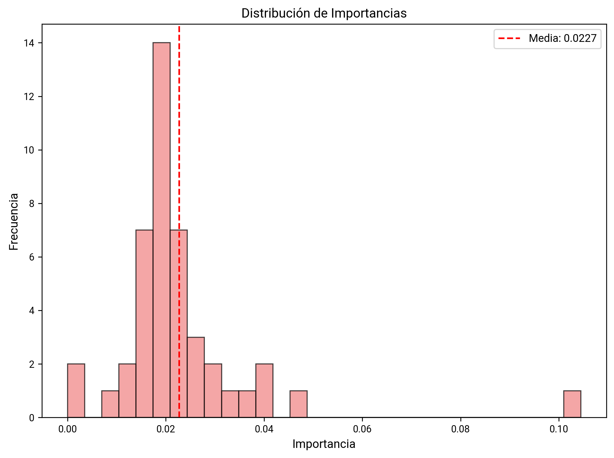

# Análisis de Selección de Características

Análisis de importancia y selección de características del dataset sin las asignaturas Ciencias Sociales, Ciencias Naturales, Matemáticas y Lengua Castellana y sin las características de Moodle

## Importancia de Características
**Gráfica de barras horizontales** que muestra las características más importantes según el modelo de XGBoost.

**Qué muestra:**
- Las 20 características con mayor importancia según el modelo XGBoost
- La longitud de la barra indica el valor de importancia
- Las características están ordenadas de mayor a menor importancia
- Los valores exactos se muestran al final de cada barra

## Distribución de Importancia
**Histograma** que muestra la distribución de valores de importancia de todas las características.

**Qué muestra:**
- La frecuencia de características según su nivel de importancia
- Ayuda a identificar si hay características claramente más importantes que otras
- Permite establecer umbrales para la selección de características

## Importancia Acumulativa
**Gráfica de línea** que muestra la importancia acumulada de las características ordenadas por importancia.

**Qué muestra:**
- La curva de importancia acumulada permite identificar cuántas características son necesarias
- El punto de inflexión indica el número óptimo de características
- Ayuda a determinar el umbral para la selección de características

## Análisis SHAP
**Gráfica de barras** que muestra los valores SHAP (SHapley Additive exPlanations) para las características más importantes.

**Qué muestra:**
- Los valores SHAP proporcionan explicaciones locales de las predicciones del modelo
- Muestra cómo cada característica contribuye a la predicción
- Los valores positivos indican contribución positiva, los negativos contribución negativa

## Matriz de Confusión
**Matriz de confusión** que evalúa el rendimiento del modelo de clasificación.

**Qué muestra:**
- La precisión del modelo en la clasificación de estudiantes
- Verdaderos positivos, falsos positivos, verdaderos negativos y falsos negativos
- Métricas de rendimiento como precisión, recall y F1-score