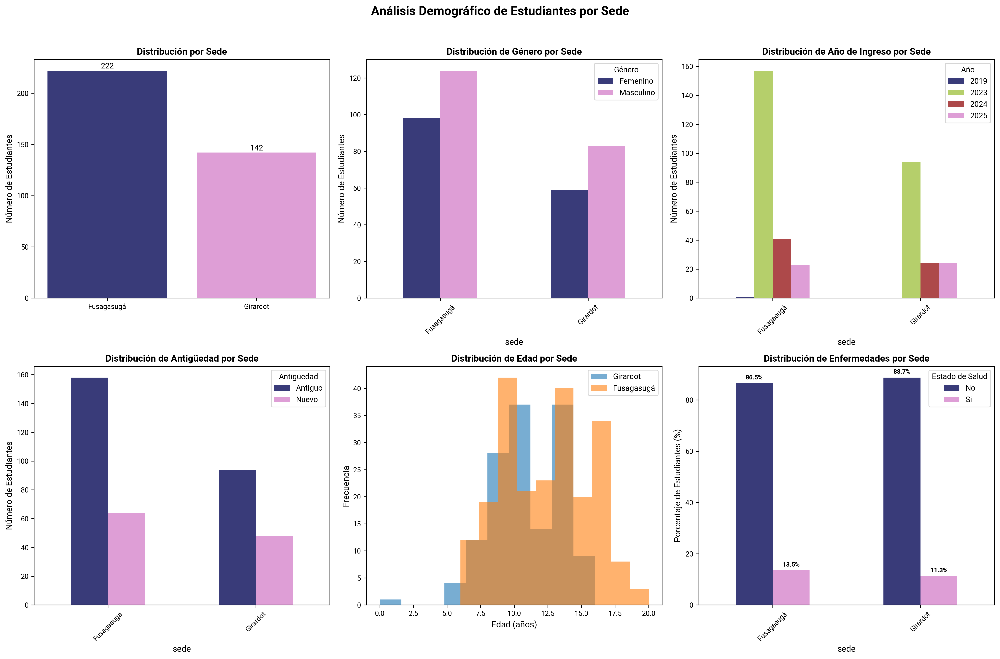
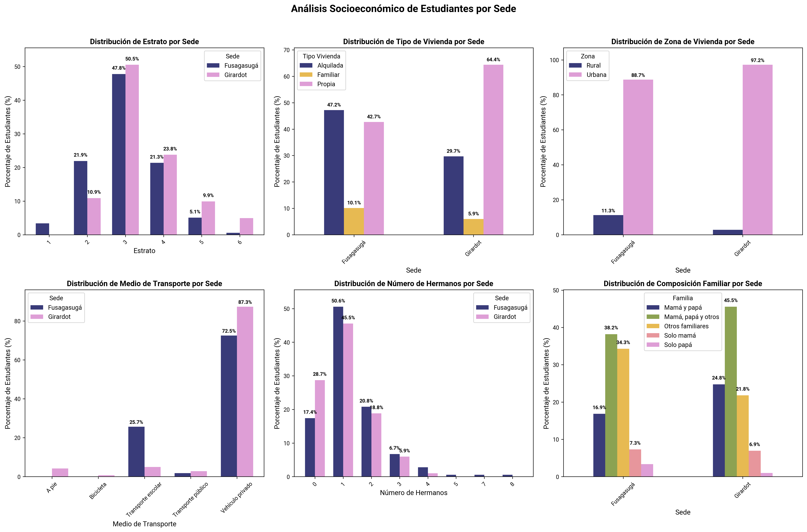
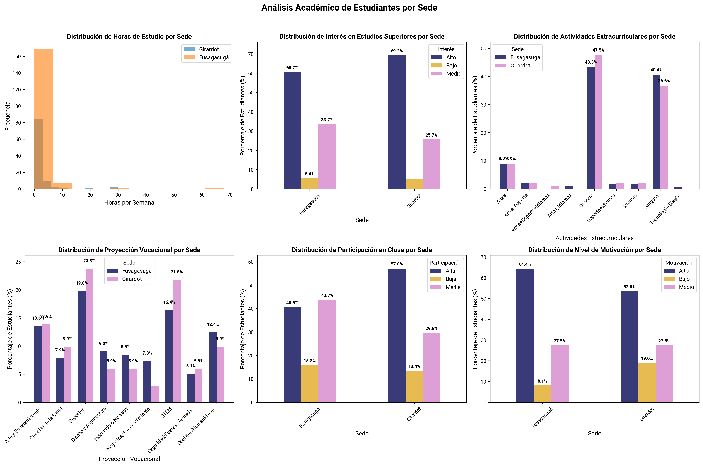
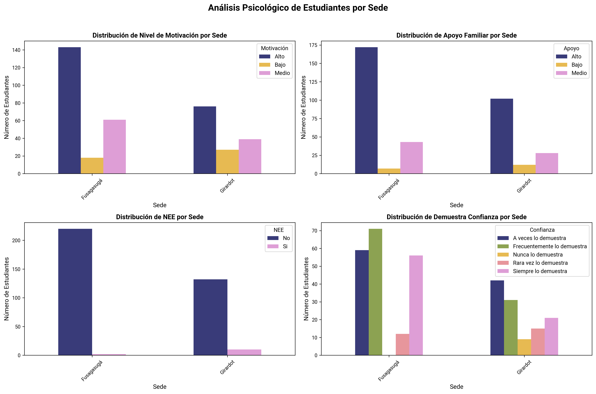

# Análisis Exploratorio de Datos de Estudiantes 2024-2025

## Resumen

Este análisis explora las características demográficas, socioeconómicas, académicas y psicológicas de los estudiantes de la institución educativa.

**Sedes:** Fusagasugá, Girardot  
**Total estudiantes:** 364  
**Total variables:** 35  
**Distribución por sede:**
- Fusagasugá: 222 estudiantes (61.0%)
- Girardot: 142 estudiantes (39.0%)

---

## 1. Análisis Demográfico

Análisis de las características demográficas de los estudiantes, comparando distribuciones entre sedes.

### Interpretación

- **Distribución por Sede:** Comparación del número total de estudiantes entre Fusagasugá y Girardot
- **Género por Sede:** Distribución de género (masculino/femenino) en cada sede
- **Año de Ingreso por Sede:** Años de ingreso de estudiantes por año académico
- **Antigüedad por Sede:** Tiempo de permanencia de los estudiantes en la institución
- **Distribución de Edad por Sede:** Histogramas superpuestos mostrando la distribución de edades
- **Enfermedades por Sede:** Estado de salud de los estudiantes (con/sin enfermedades)

### Conclusiones

- Fusagasugá tiene una matrícula más consolidada o establecida, posiblemente por mayor trayectoria o capacidad operativa.
- En ambas sedes predomina el género masculino.
- La mayor parte de los estudiantes ingresó en 2023, año de crecimiento notable en ambas sedes.
- En ambas sedes predomina la categoría de estudiantes antiguos.
- En Fusagasugá, la distribución es más amplia, alcanzando edades de 16 a 18 años.
- En Girardot, la mayoría de estudiantes se concentra entre 8 y 13 años.
- Los resultados reflejan un estado de salud general favorable. La gran mayoría de estudiantes (más del 85%) no presenta enfermedades

## 2. Análisis Socioeconómico

Evaluación de las condiciones socioeconómicas de los estudiantes y sus familias, analizando diferencias entre sedes.

### Interpretación

- **Estrato por Sede:** Distribución de estratos socioeconómicos (1-6) en cada sede
- **Tipo de Vivienda por Sede:** Tipos de vivienda donde residen los estudiantes
- **Zona de Vivienda por Sede:** Ubicación geográfica de las viviendas (urbana/rural)
- **Medio de Transporte por Sede:** Medios de transporte utilizados para llegar a la institución
- **Número de Hermanos por Sede:** Tamaño de las familias de los estudiantes
- **Composición Familiar por Sede:** Estructura familiar de los estudiantes

### Conclusiones

- La mayoría de los estudiantes pertenecen a los estratos 2 y 3.
- Los estratos 1, 5 y 6 son minoritarios.
- En Fusagasugá, predomina la vivienda alquilada, con un porcentaje ligeramente menor de vivienda propia.
- En Girardot, la mayoría de los estudiantes residen en vivienda propia.
- Ambas sedes presentan fuerte concentración urbana.
- El transporte privado es el más utilizado, aunque Girardot presenta más diversidad de medios de transporte.
- Las familias tienden a ser pequeñas o medianas, con un promedio de 1 a 2 hijos.
- Predominan los núcleos familiares completos o extendidos, lo que sugiere buen nivel de acompañamiento familiar.

## 3. Análisis Académico

Evaluación del desempeño y características académicas de los estudiantes, incluyendo hábitos de estudio y proyecciones vocacionales.

### Interpretación

- **Horas de Estudio por Sede:** Distribución de horas semanales dedicadas al estudio en casa
- **Interés en Estudios Superiores por Sede:** Nivel de interés en continuar estudios universitarios
- **Actividades Extracurriculares por Sede:** Participación en actividades fuera del currículo académico
- **Proyección Vocacional por Sede:** Aspiraciones profesionales y vocacionales de los estudiantes
- **Participación en Clase por Sede:** Nivel de participación activa en las clases
- **Nivel de Motivación por Sede:** Grado de motivación académica de los estudiantes

### Conclusiones

- En ambas sedes, la mayoría de los estudiantes dedica menos de 10 horas semanales al estudio fuera del aula.
- Hay algunos casos atípicos con más de 30 horas de estudio en casa.
- El interés por la educación superior es alto en ambas sedes, ligeramente superior en Girardot. Esto sugiere expectativas positivas hacia la continuidad educativa.
- Las actividades deportivas son las más populares en ambas sedes.
- Se observa una limitada oferta o interés en áreas culturales y tecnológicas, lo cual podría explorarse para fortalecer habilidades complementarias.
- Las vocaciones se orientan principalmente a carreras deportivas y STEM, con menor interés en áreas artísticas o sociales.
- Los niveles bajos en participación en clase son minoritarios, lo que indica una buena dinámica participativa general.
- En general, los estudiantes se muestran motivados, especialmente en Fusagasugá. Girardot presenta una proporción mayor de estudiantes con motivación baja, lo que sugiere necesidad de refuerzo emocional o pedagógico.

## 4. Análisis Psicológico

Evaluación de aspectos psicológicos y socioemocionales que influyen en el desarrollo académico de los estudiantes.

### Interpretación

- **Nivel de Motivación por Sede:** Distribución de los niveles de motivación académica
- **Apoyo Familiar por Sede:** Percepción del apoyo familiar en el proceso educativo
- **NEE por Sede:** Necesidades Educativas Especiales de los estudiantes
- **Demuestra Confianza por Sede:** Nivel de confianza demostrado por los estudiantes

### Conclusiones
- La mayoría de los estudiantes manifiesta una actitud positiva hacia el estudio, especialmente en Fusagasugá, aunque en Girardot se observa ligeramente menor y más estudiantes con bajo nivel de motivación.

- Se muestra una base sólida de apoyo familiar en ambas sedes.

- Existe una baja incidencia de estudiantes con necesidades educativas especiales, ligeramente mayor en Girardot.

- La mayoría de los estudiantes muestra niveles moderados o altos de autoconfianza, especialmente en Fusagasugá. En Girardot, aunque los niveles de confianza son más variados.