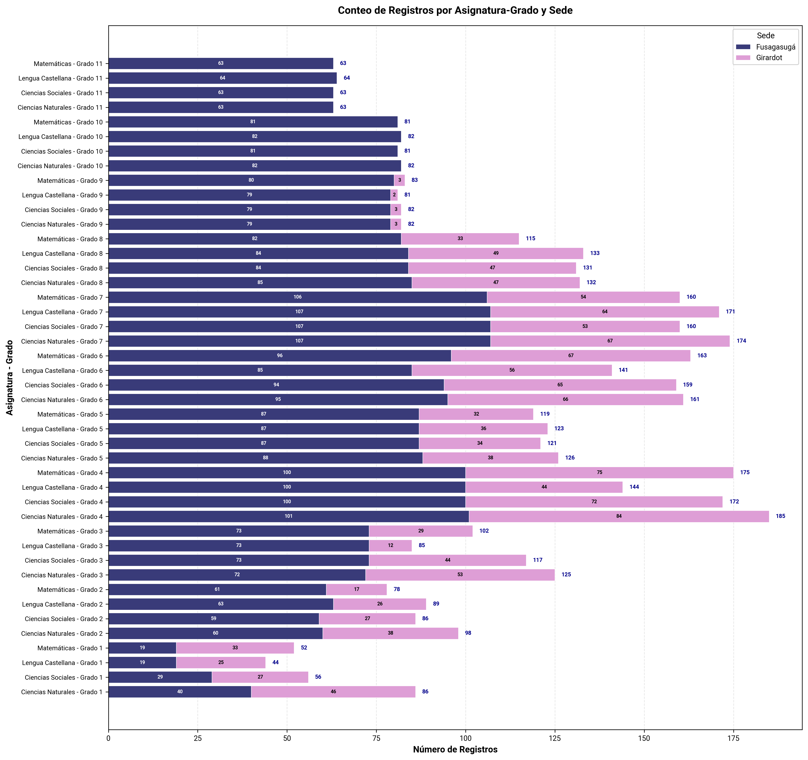
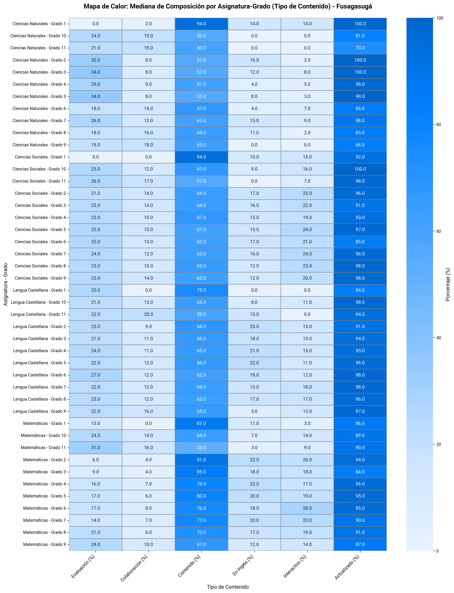
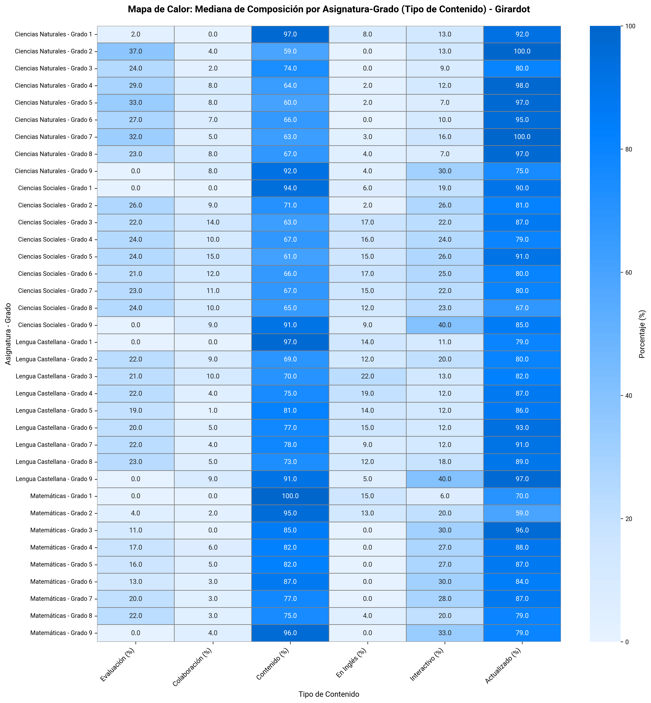
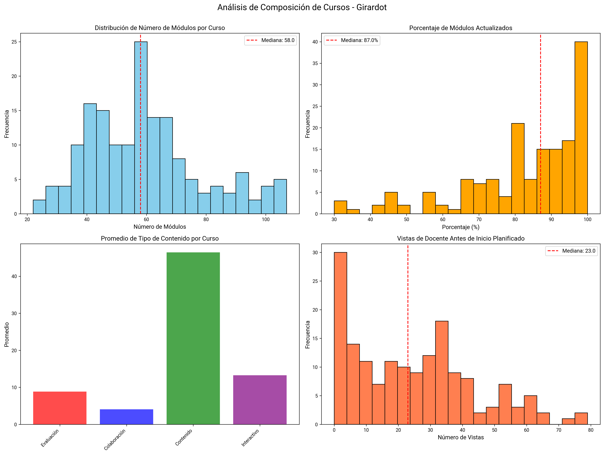
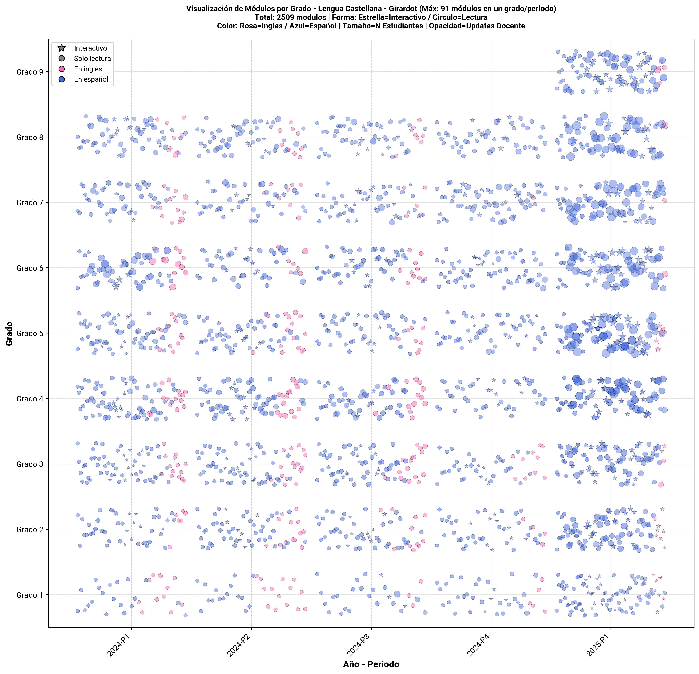
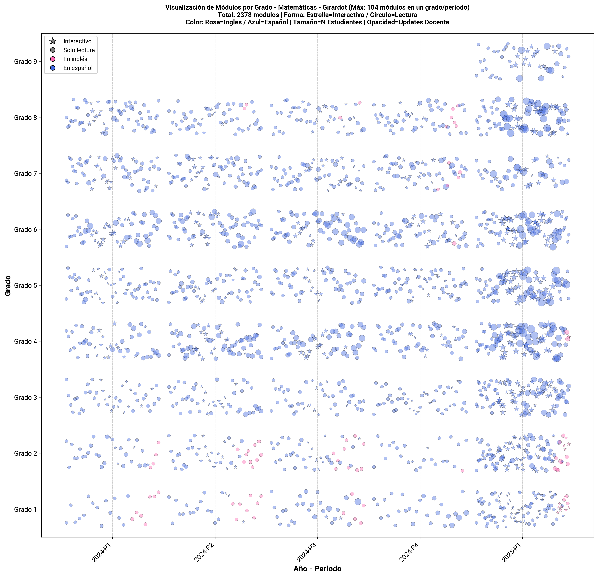
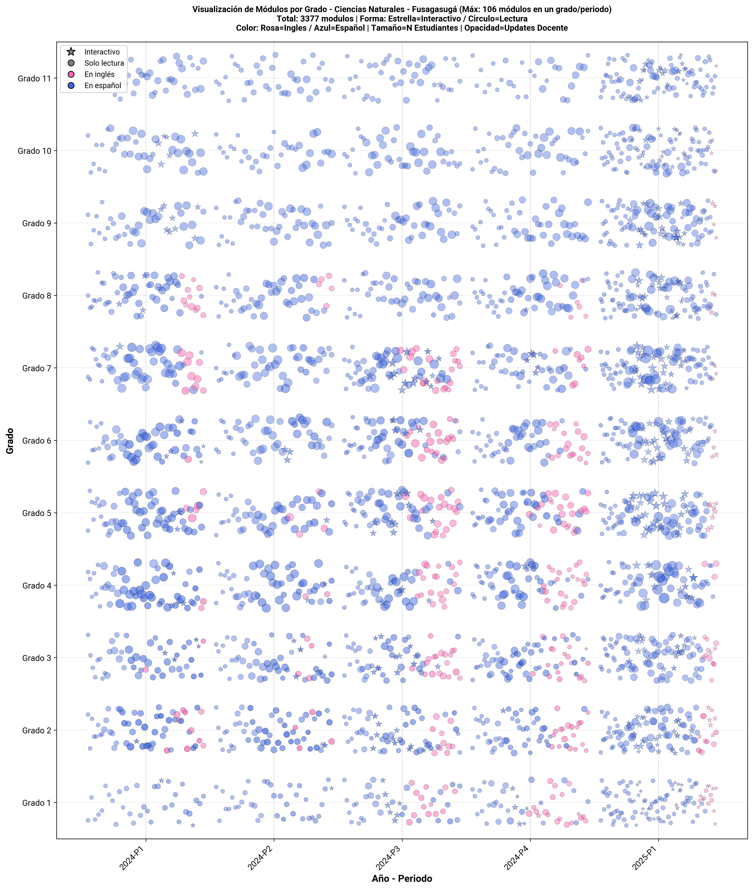
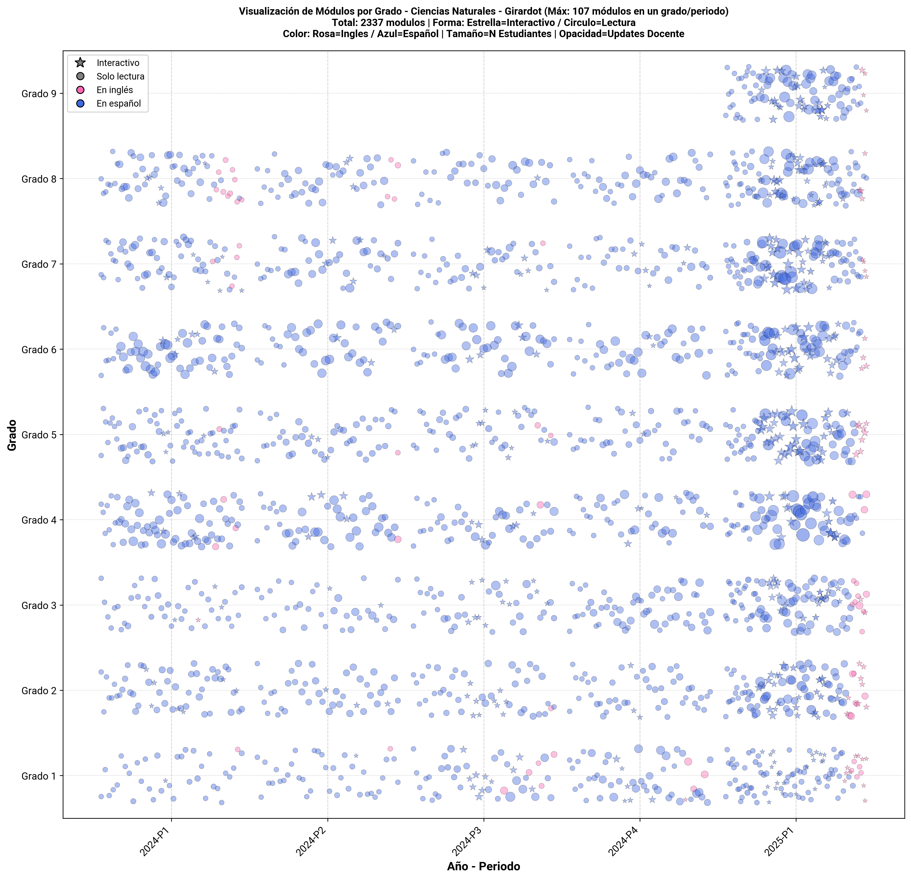
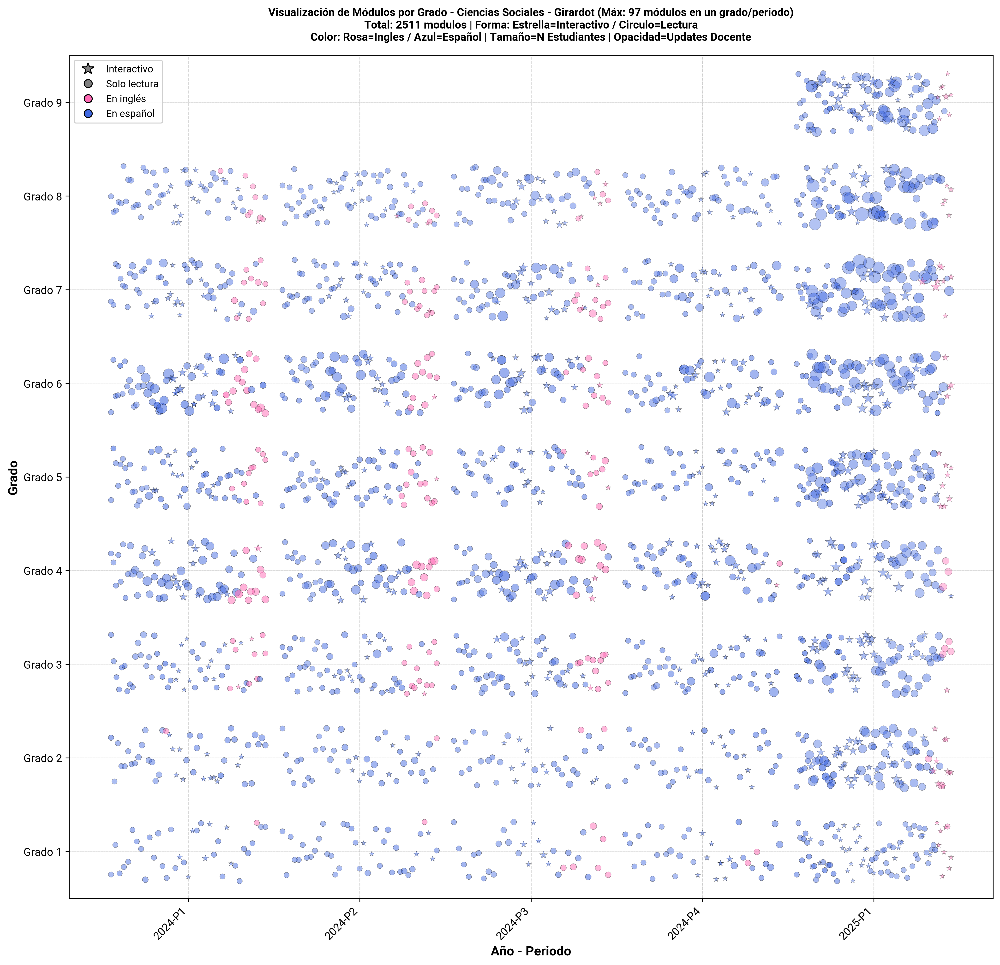

# Análisis de Cursos en Moodle

## Resumen

Este análisis explora la composición de los cursos en la plataforma Moodle, de las 4 asignaturas básicas (Lengua Castellana, Matemáticas, Ciencias Naturales, Ciencias Sociales) desde 2024-1 hasta 2025-1.

---

## 1. Conteo de Registros por Asignatura-Grado y Sede

### Visualización

### Descripción

Este gráfico de barras apiladas muestra el volumen de registros (estudiante × período) para cada combinación de asignatura y grado, diferenciando por sede mediante colores.

### Interpretación

- **Formato de etiquetas:**
  - **Eje Y:** Asignatura - Grado (ej: "Lengua Castellana - Grado 6")
  - **Segmentos de colores:** Cada color representa una sede
  - **Números en segmentos:** Cantidad de registros de esa sede
  - **Número al final de la barra:** Total de registros (suma de todas las sedes)

Nota: Cada registro corresponde a un estudiante x periodo en la asignatura

## 2. Mapas de Calor: Composición de Cursos por Asignatura-Grado

### Visualizaciones

#### Sede: Fusagasugá

#### Sede: Girardot

### Descripción

Los mapas de calor muestran la mediana de porcentajes para cada tipo de contenido en los cursos, por combinación de asignatura y grado.

**Tipos de contenido analizados:**
1. **Evaluación (%):** Porcentaje de módulos de evaluación
2. **Colaboración (%):** Porcentaje de actividades colaborativas
3. **Contenido (%):** Porcentaje de materiales informativos
4. **En Inglés (%):** Porcentaje de contenido en idioma inglés
5. **Interactivo (%):** Porcentaje de módulos que requieren interacción del estudiante
6. **Actualizado (%):** Porcentaje de módulos actualizados por docentes durante el período

### Interpretación

- **Métrica:** Se usa la mediana para evitar el sesgo de valores extremos
- **Ejes:**
  - **Horizontal:** Tipos de contenido
  - **Vertical:** Asignatura - Grado
- **Escala de colores:**
  - 🔵 **Azul claro (0-20%):** Muy bajo uso de este tipo de contenido
  - 🔵 **Azul medio (20-50%):** Uso moderado
  - 🔵 **Azul fuerte (50-80%):** Uso alto
  - 🔵 **Azul oscuro (>80%):** Uso muy alto

### Conclusiones

- En ambas sedes, el tipo de recurso más frecuente son los contenidos (archivos, lecturas, recursos estáticos).

- Los tipos de contenido interactivo rara vez superan el 20 %, con excepción en Fusagasugá (hasta 28 %) y valores mínimos en Girardot

## 3. Análisis de Composición de Cursos

### Visualizaciones

#### Sede: Fusagasugá

#### Sede: Girardot

#### **1. Distribución de Número de Módulos por Curso (Superior Izquierda)**
- Histograma mostrando cuántos módulos tiene cada curso típicamente
- Línea roja indica la mediana
- **Interpretación:**
  - **Mediana 20-40 módulos**
  - **Mediana <10 módulos**
  - **Mediana >60 módulos**

#### **2. Porcentaje de Módulos Actualizados (Superior Derecha)**
- Distribución del % de módulos actualizados por docentes
- **Interpretación:**
  - **>60%:** Contenido mantenido activamente
  - **30-60%:** Actualización moderada
  - **<30%:** Contenido desactualizado

#### **3. Promedio de Tipo de Contenido por Curso (Inferior Izquierda)**
- Gráfico de barras comparando la cantidad promedio de cada tipo de contenido
- **Categorías:**
  - 🔴 **Evaluación:** Quizzes, exámenes
  - 🔵 **Colaboración:** Foros
  - 🟢 **Contenido:** Materiales de lectura
  - 🟣 **Interactivo:** Actividades que requieren participación activa

#### **4. Vistas de Docente Antes de Inicio Planificado (Inferior Derecha)**
- Histograma de cuántas veces los docentes accedieron al curso antes de su inicio oficial
- **Interpretación:**
  - **>10 vistas**
  - **3-10 vistas**
  - **< 3 vistas**

### Conclusiones

- **Fusagasugá:** 
    - Registra un mayor número de módulos por curso y un porcentaje de actualización más alto.
    - La distribución de tipos de contenido es más equilibrada, con presencia de actividades evaluativas e interactivas y la mayoría contenido de solo lectura.
    - Las vistas docentes previas al inicio son ligeramente menores.

- **Girardot:** 
    - Presenta un menor número de módulos por curso y un porcentaje de actualización.
    - Las vistas docentes antes del inicio son más frecuentes.
    - El contenido muestra una menor diversidad en comparación con Fusagasugá.

## 4. Visualización de Módulos por Grado

### Visualizaciones por Asignatura

#### Lengua Castellana

**Fusagasugá:**

**Girardot:**

#### Matemáticas

**Fusagasugá:**

**Girardot:**

#### Ciencias Naturales

**Fusagasugá:**

**Girardot:**

#### Ciencias Sociales

**Fusagasugá:**

**Girardot:**

### Interpretación

Las gráficas visualizan todos los módulos de una asignatura por periodo y año, mostrando múltiples características simultáneamente:

- **Eje X:** Año-Período
- **Eje Y:** Grado (1 a 11)
- **Forma del punto:**
  - **Estrella:** Módulo interactivo
  - **Círculo:** Módulo de solo lectura
- **Color del punto:**
  - **Rosa:** Contenido en inglés
  - **Azul:** Contenido en español
- **Tamaño del punto:** Número de estudiantes únicos que accedieron al módulo
  - Punto grande = muchos estudiantes
  - Punto pequeño = pocos estudiantes
- **Opacidad del punto:** Cantidad de actualizaciones del docente
  - Más opaco = más actualizaciones
  - Más transparente = pocas o ninguna actualización

### Conclusiones

- Fusagasugá presenta mayor volumen, diversidad y continuidad en el uso de módulos, reflejando mayor uso de Moodle.

- Girardot, en cambio, muestra un aumento reciente de actividad (2024-P4 a 2025-P1), asociado con la transición hacia Edukrea.

- Fusagasugá se caracteriza por una alta densidad de módulos, mayor actualización docente, participación estudiantil más amplia y mayor presencia de contenidos interactivos y bilingües.

- Girardot evidencia menor densidad y frecuencia de actualización, así como una participación más limitada, predominando los recursos tradicionales de lectura.
