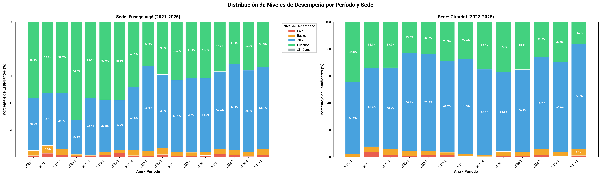
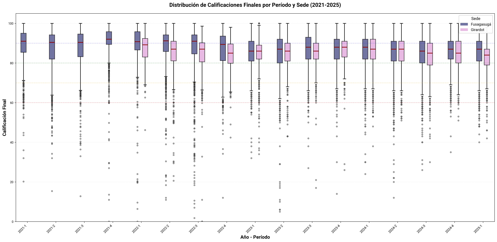
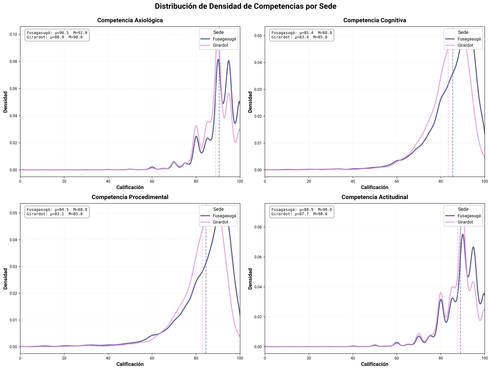
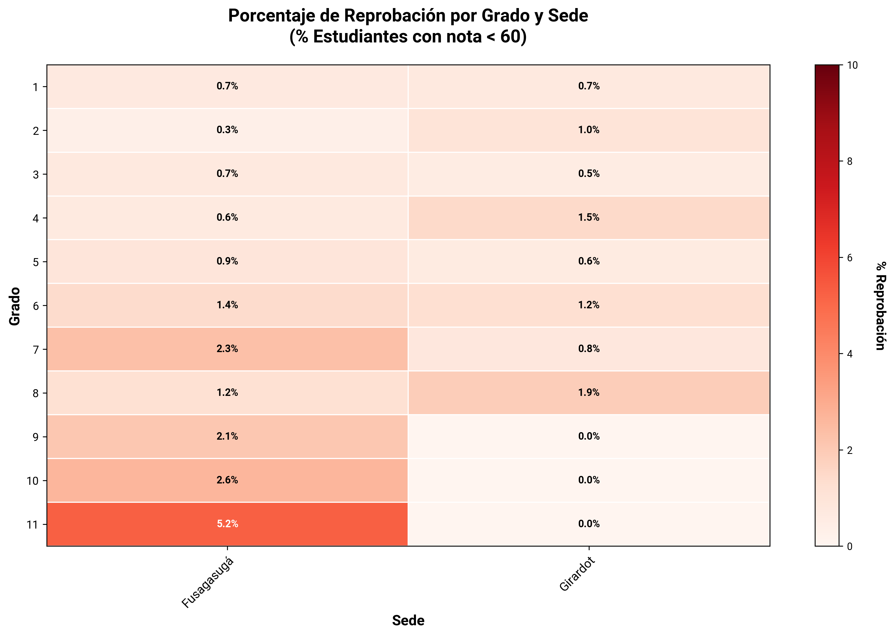
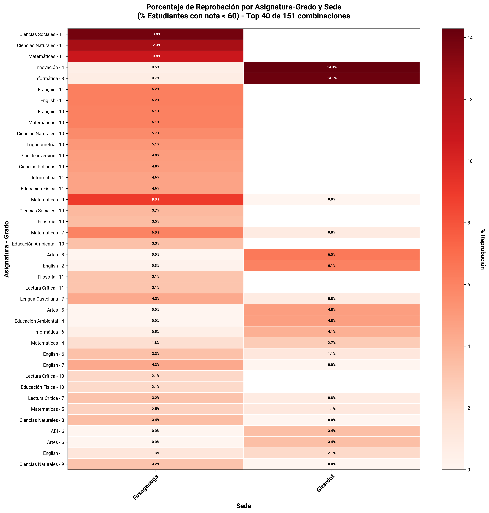
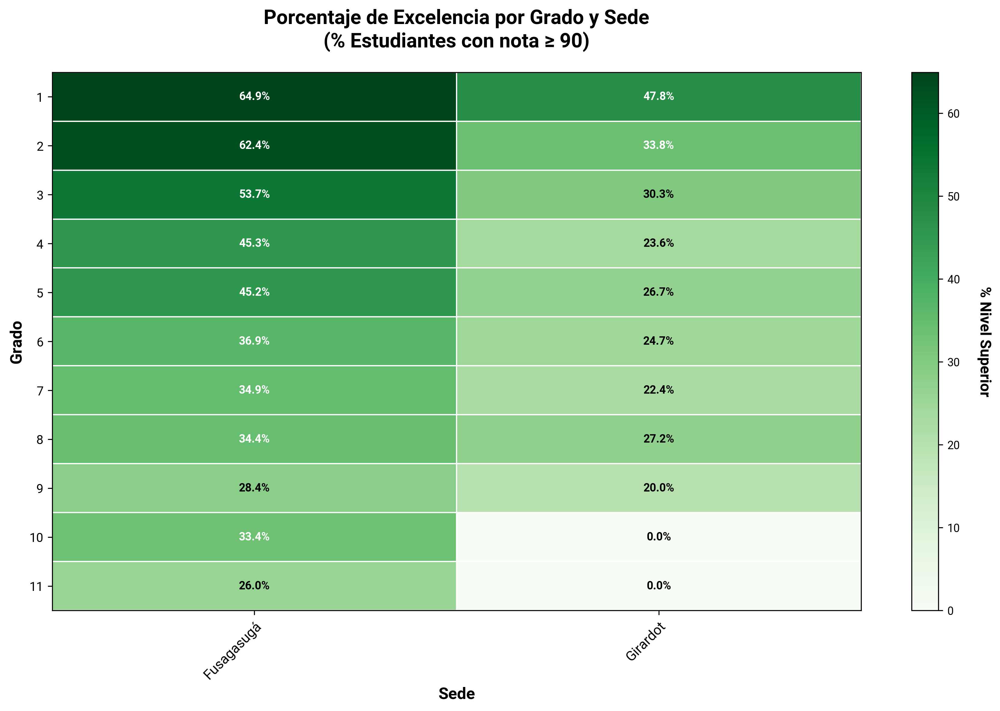
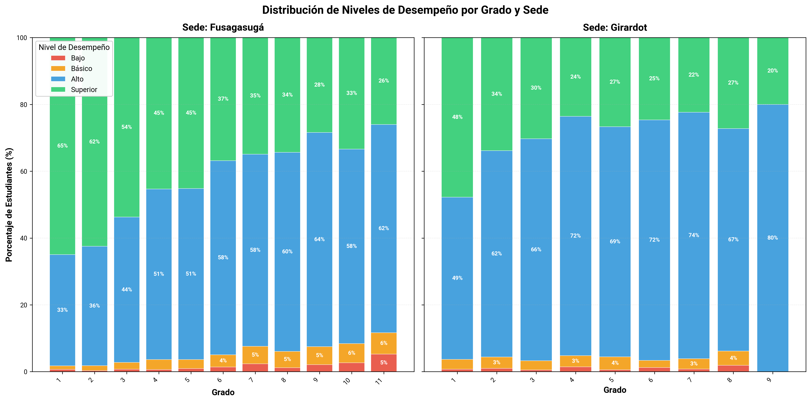
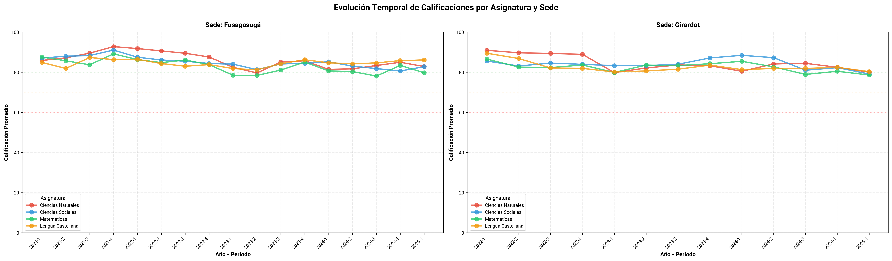
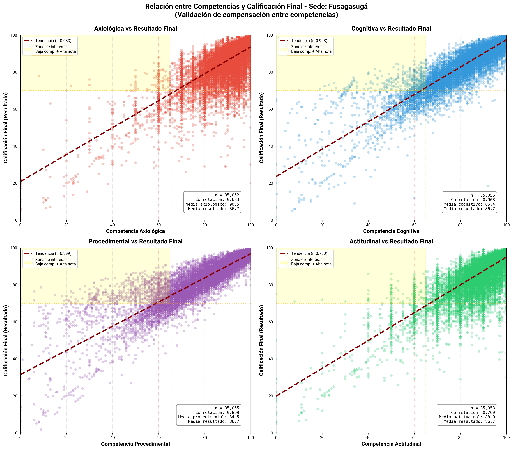
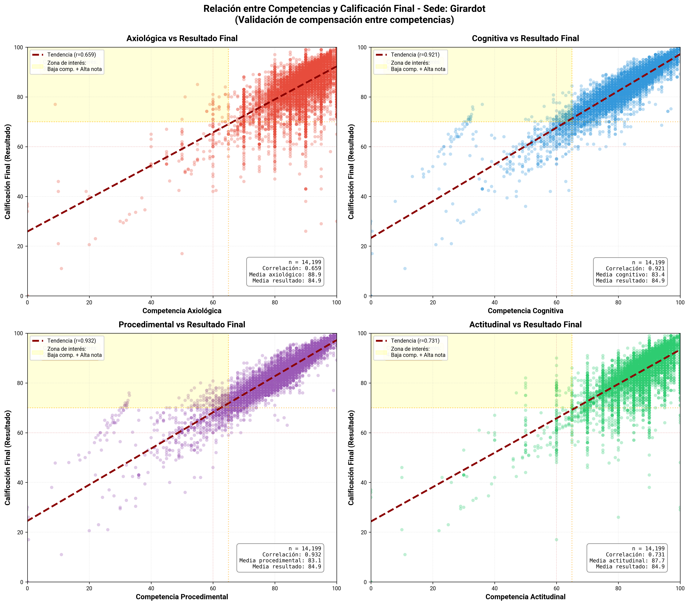

# Análisis de Calificaciones Históricas 2021-2025

## Resumen

Este análisis explora las calificaciones históricas de estudiantes.

**Período analizado:** 2021-1 a 2025-1  
**Sedes:** Fusagasugá, Girardot  
**Grados:** 1 - 11

---

## 1. Distribución de Niveles de Desempeño por Período y Sede

Gráfico de barras apiladas que muestra la evolución temporal de los niveles de desempeño académico por período y sede.

### Interpretación

- **Escala de niveles:**
  - 🔴 **Bajo (<60):** Estudiantes reprobados
  - 🟠 **Básico (60-69):** Desempeño apenas aprobatorio
  - 🔵 **Alto (70-89):** Buen desempeño académico
  - 🟢 **Superior (≥90):** Excelencia académica

- **Formato:** Los porcentajes muestran la distribución relativa de estudiantes en cada nivel por período académico.

- **Análisis temporal:** Permite identificar tendencias de mejora o deterioro en el desempeño a lo largo del tiempo.

### Conclusiones

- Ambas sedes tienden hacia una estructura más homogénea con predominio del nivel alto, lo que sugiere consistencia en la evaluación institucional.

- La baja proporción de niveles bajo y básico refleja control sobre la reprobación.

- En Girardot se observa menor proporción de estudiantes en nivel superior, lo que puede indicar diferencias pedagógicas.

## 2. Distribución de Calificaciones por Período y Sede

Boxplots que muestran la distribución de las calificaciones finales por período académico y sede.

### Interpretación

- **Componentes del boxplot:**
  - **Línea central (mediana):** Calificación donde el 50% está por encima y 50% por debajo
  - **Caja:** Rango intercuartílico (Q1 a Q3) - donde se concentra el 50% central de los datos
  - **Bigotes:** Extensión hasta valores mínimos y máximos (dentro de 1.5×IQR)
  - **Puntos:** Valores atípicos (outliers)

- **Líneas de referencia:**
  - 🔴 **60:** Umbral de aprobación (Bajo)
  - 🟠 **70:** Inicio de desempeño Básico
  - 🟢 **80:** Inicio de desempeño Alto
  - 🔵 **90:** Inicio de desempeño Superior

- **Mediana alta (>80):** Indica un buen desempeño general del grupo
- **Caja amplia:** Alta variabilidad en el rendimiento estudiantil
- **Mediana cerca de 60:** Señal de alerta - grupo en riesgo

### Conclusiones

- Fusagasugá mantiene medianas altas y estables, pero presenta una mayor cantidad de valores atípicos, especialmente hacia la zona baja (< 60). Esto sugiere más casos individuales de bajo desempeño, aunque sin afectar la tendencia general del grupo.

- Girardot tiene medianas levemente inferiores pero con menor cantidad de valores extremos, indicando una distribución más compacta y homogénea.

- Mientras Fusagasugá evidencia un rendimiento globalmente alto con mayor dispersión individual, Girardot refleja un comportamiento más uniforme, aunque con medianas ligeramente menores.

## 3. Densidad de Competencias por Sede

Gráficos de densidad que muestran la distribución de calificaciones en las cuatro competencias evaluadas: Axiológica, Cognitiva, Procedimental y Actitudinal, comparando entre sedes.

### Interpretación

- **Curva de densidad:** Muestra dónde se concentran las calificaciones
  - **Pico alto y estrecho:** Calificaciones muy homogéneas
  - **Curva ancha y plana:** Alta dispersión de resultados

- **Líneas verticales discontinuas:** Indican la media (μ) por sede

- **Estadísticas incluidas:**
  - **μ (media):** Promedio de la competencia
  - **M (mediana):** Valor central de la distribución

### Conclusiones

- En Fusagasugá las curvas presentan concentraciones altas en los rangos superiores (80–100) con picos más marcados, lo que indica una mayor frecuencia de calificaciones elevadas y menor dispersión.

- En Girardot se pueden observar patrones similares, aunque con curvas ligeramente desplazadas hacia la izquierda en las competencias Procedimental y Cognitiva.

- Las competencias Axiológica y Actitudinal tienden a tener mayores concentraciones en valores altos y múltiples picos, mientras que la Cognitiva y Procedimental son más amplias, con mayor variabilidad en ambas sedes.

## 4. Proporción de Reprobación por Grado y Sede

Mapa de calor que muestra el porcentaje de estudiantes con calificación final menor a 60 (reprobados) por grado académico y sede.

### Interpretación

- **Porcentaje mostrado:** Indica qué proporción del grado está en riesgo académico

- **Patrones a identificar:**
  - **Puntos calientes:** Celdas específicas con porcentajes muy altos

### Conclusiones

- Fusagasugá presenta una tendencia ascendente de reprobación a medida que aumenta el grado.

- Girardot mantiene valores bajos y estables en todos los grados, sin superar el 2%, y con ausencia de reprobación en varios niveles superiores.

- La diferencia entre sedes es marcada: Fusagasugá muestra mayor variabilidad y un incremento progresivo en los grados altos, mientras Girardot conserva una distribución homogénea y controlada en todo el rango escolar.

## 5. Proporción de Reprobación por Asignatura-Grado y Sede

Mapa de calor que muestra las **Top 40 combinaciones de asignatura-grado** con mayor proporción de reprobación.

### Interpretación

- **Eje vertical:** Combinaciones de asignatura y grado
- **Eje horizontal:** Sedes
- **Valores:** Porcentaje de estudiantes reprobados en esa combinación

### Conclusiones

- En Fusagasugá las mayores proporciones se concentran en los grados superiores, especialmente en Ciencias Sociales 11°, Ciencias Naturales 11° y Matemáticas 11°. También aparecen niveles intermedios en asignaturas técnicas y de idiomas.

- Girardot muestra picos aislados de reprobación en Innovación 4 e Informática 8°, mientras el resto de las asignaturas mantienen porcentajes bajos o nulos.

- En Fusagasugá la reprobación es más amplia y constante en distintas áreas del currículo, mientras que en Girardot se concentra en unos pocos casos específicos, reflejando un patrón más localizado.
## 6. Proporciones de Excelencia por Grado y Sede

Mapa de calor que muestra el porcentaje de estudiantes con calificación final ≥90 (nivel Superior) por grado académico y sede.

### Interpretación

- **Porcentaje mostrado:** Indica qué proporción del grado alcanza desempeño Superior

### Conclusiones

- Fusagasugá registra altos niveles de excelencia en primaria, con una disminución gradual hacia los niveles superiores, alcanzando su punto más bajo en 11°.

- Girardot mantiene porcentajes menores y más estables en la mayoría de los grados.

## 7. Distribución de Niveles por Grado y Sede

Gráfico de barras apiladas que muestra la distribución porcentual de niveles de desempeño por grado académico en cada sede.

### Interpretación

- **Formato:** Cada barra representa un grado, dividida en segmentos coloreados según nivel de desempeño

- **Escala de niveles:**
  - 🔴 **Bajo (<60):** Reprobados
  - 🟠 **Básico (60-69):** Aprobados con desempeño básico
  - 🔵 **Alto (70-89):** Buen desempeño
  - 🟢 **Superior (≥90):** Excelencia

- **Señales de alerta:**
  - Segmento rojo extenso (>15%)
  - Barra dominada por naranja (mucho "básico")
  - Poco verde y azul combinados

### Conclusiones

- En Fusagasugá primaria muestra una alta proporción de nivel superior, que disminuye progresivamente conforme avanza la escolaridad. El nivel alto se fortalece en los grados medios y superiores, mientras los niveles bajo y básico permanecen con tendencia ascendente.

- En Girardot se presenta mayor proporción del nivel alto en casi todos los grados. El nivel superior es menor y más estable, mientras que los niveles bajo y básico se mantienen en valores reducidos.

## 8. Evolución Temporal de Asignaturas por Sede

Gráficos de líneas que muestran la evolución del promedio de calificaciones en las 4 asignaturas principales a lo largo de los períodos académicos, por sede.

### Interpretación

- **Ejes:**
  - **Horizontal:** Períodos académicos (año-semestre)
  - **Vertical:** Calificación promedio (0-100)

- **Líneas de referencia:**
  - 🔴 **60:** Umbral de aprobación
  - 🟠 **70:** Inicio de desempeño Básico
  - 🟢 **80:** Inicio de desempeño Alto

- **Análisis comparativo:**
  - **Líneas muy separadas:** Asignaturas con desempeño muy diferente
  - **Líneas paralelas:** Tendencias comunes afectan todas las asignaturas
  - **Líneas que se cruzan:** Cambios relativos en la dificultad percibida

### Conclusiones

- En Fusagasugá las calificaciones se mantienen estables en rangos altos (80–90), con leves fluctuaciones entre períodos. Ciencias Naturales y Lengua Castellana conservan los valores más consistentes, mientras Matemáticas muestra ligeras caídas en algunos bimestres.

- Girardot tiene un patrón más plano con menos variación entre asignaturas, aunque con valores ligeramente menores que los de Fusagasugá. Ciencias Sociales presenta mayor estabilidad en el tiempo.

- Ambas sedes mantienen trayectorias similares con rendimientos estables y sin caídas pronunciadas.

## 9. Relación entre Competencias y Calificación Final

### Visualizaciones

#### Sede: Fusagasugá

#### Sede: Girardot

Diagramas de dispersión que muestran la relación entre cada competencia individual (Axiológica, Cognitiva, Procedimental, Actitudinal) y la calificación final del estudiante.

### Interpretación

- **Ejes:**
  - **Horizontal:** Calificación en la competencia específica (0-100)
  - **Vertical:** Calificación final (0-100)

- **Elementos del gráfico:**
  - **Puntos:** Cada punto representa un estudiante
  - **Línea roja discontinua:** Tendencia lineal (regresión)
  - **Área amarilla:** "Zona de interés" - Baja competencia + Alta nota final
  - **Estadísticas incluidas:**
    - **r (correlación):** De -1 a 1, mide la fuerza de la relación
    - **n:** Número de casos analizados
    - **Casos en zona de interés:** Estudiantes con patrón anómalo

- **Interpretación de correlación (r):**
  - **r > 0.7:** Correlación fuerte positiva (esperado)
  - **r = 0.4-0.7:** Correlación moderada
  - **r < 0.4:** Correlación débil (señal de alerta)

- **Zona de interés (amarilla):**
  - **Alto porcentaje:** Posible compensación entre competencias
  - **Interpretación:** Estudiantes con baja competencia específica pero nota final alta
  - **Hipótesis:** El sistema de calificación podría permitir compensar debilidades en una competencia con fortalezas en otras

### Conclusiones

- En Fusagasugá las correlaciones son altas en todas las competencias, especialmente en la Cognitiva y Procedimental, donde los puntos siguen estrechamente la línea de tendencia. Esto indica una correspondencia consistente entre desempeño por competencia y resultado global.

- Girardot presenta un patrón muy similar, con correlaciones igualmente fuertes. Las relaciones más ajustadas se observan en la Cognitiva y Procedimental, mientras que la Axiológica y Actitudinal muestran mayor dispersión.

- En Fusagasugá en las competencias Cognitiva y Procedimental, hay una acumulación visible de puntos en la zona amarilla, que corresponde a estudiantes con bajas calificaciones en la competencia pero notas finales altas.

- Aunque la relación general entre competencia y resultado es muy fuerte y coherente, hay un grupo de estudiantes que logra buenos resultados finales a pesar de un desempeño limitado en la competencia específica.